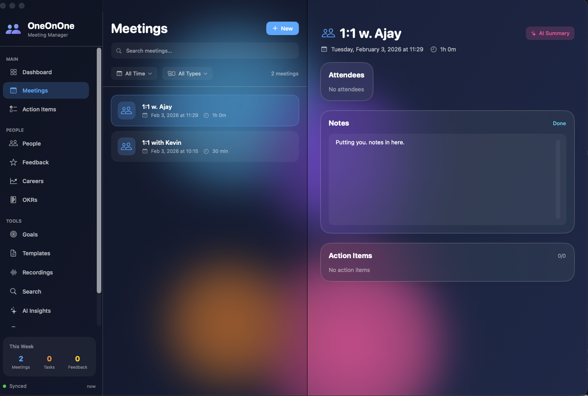

# OneOnOne



AI-assisted app for managing 1:1 and team meetings on macOS.

## Features

### Meeting Management
- Track all your 1:1 and team meetings in one place
- Support for multiple meeting types: 1:1, Team, Stand-up, Retrospective, Planning, Review, Brainstorm
- Record meeting notes, agendas, and outcomes
- Automatic action item tracking from meetings
- Decision logging with rationale

### People Management
- Maintain profiles for everyone you meet with
- Track meeting frequency preferences
- View meeting history per person
- Custom tags and notes for each person

### Action Items
- Central view of all action items across meetings
- Priority levels (Low, Medium, High, Urgent)
- Due date tracking with overdue alerts
- Assignee management
- Filter by priority, assignee, or completion status

### Goal Tracking
- Set and track goals for yourself and team members
- Goal categories: Development, Performance, Learning, Project, Personal, Team, Career
- Milestone tracking with completion progress
- Link goals to related meetings

### AI-Powered Insights
- **Meeting Summaries**: AI-generated summaries of meeting notes
- **Weekly Recaps**: Automated summaries of your week
- **Conversation Starters**: AI suggestions for upcoming 1:1s based on past discussions
- **Action Item Extraction**: Automatically identify action items from notes
- **Goal Analysis**: AI assessment of goal progress and recommendations

### Calendar Integration
- Sync with macOS Calendar
- Create calendar events for meetings
- Recurring meeting support
- Find available meeting slots

### Data Portability
- Export/Import data in JSON format
- Sync across multiple computers
- Automatic backups

## AI Models

OneOnOne uses local MLX models for all AI features, ensuring your meeting data never leaves your computer. Supported models include:
- Llama 3.2 3B Instruct (recommended)
- Qwen 2.5
- Mistral
- Phi-3.5

## Requirements

- macOS 14.0 or later
- Apple Silicon Mac (M1/M2/M3/M4)
- For AI features: MLX and mlx-lm Python packages

## Installation

Download the DMG from the releases page and drag OneOnOne to your Applications folder.

### Setting up AI Features

To use AI features, install the required Python packages:

```bash
pip3 install mlx mlx-lm
```

Then download a model:

```bash
pip3 install huggingface-hub
huggingface-cli download mlx-community/Llama-3.2-3B-Instruct-4bit --local-dir ~/.mlx/models/Llama-3.2-3B-Instruct-4bit
```

## Design

OneOnOne features a modern glassmorphic design with:
- Dark navy gradient backgrounds
- Floating animated blobs
- Frosted glass UI elements
- Vibrant accent colors

The design matches other apps like MLX Code for a consistent experience.

## Privacy

All your meeting data is stored locally on your Mac. AI features run entirely on your device using MLX - no data is sent to external servers.

## Building from Source

```bash
# Install XcodeGen
brew install xcodegen

# Generate Xcode project
cd /path/to/OneOnOne
xcodegen generate

# Build
xcodebuild -project OneOnOne.xcodeproj -scheme OneOnOne -configuration Release
```

## License

MIT License

Copyright (c) 2026 Jordan Koch

Permission is hereby granted, free of charge, to any person obtaining a copy of this software and associated documentation files (the "Software"), to deal in the Software without restriction, including without limitation the rights to use, copy, modify, merge, publish, distribute, sublicense, and/or sell copies of the Software, and to permit persons to whom the Software is furnished to do so, subject to the following conditions:

The above copyright notice and this permission notice shall be included in all copies or substantial portions of the Software.

THE SOFTWARE IS PROVIDED "AS IS", WITHOUT WARRANTY OF ANY KIND, EXPRESS OR IMPLIED, INCLUDING BUT NOT LIMITED TO THE WARRANTIES OF MERCHANTABILITY, FITNESS FOR A PARTICULAR PURPOSE AND NONINFRINGEMENT. IN NO EVENT SHALL THE AUTHORS OR COPYRIGHT HOLDERS BE LIABLE FOR ANY CLAIM, DAMAGES OR OTHER LIABILITY, WHETHER IN AN ACTION OF CONTRACT, TORT OR OTHERWISE, ARISING FROM, OUT OF OR IN CONNECTION WITH THE SOFTWARE OR THE USE OR OTHER DEALINGS IN THE SOFTWARE.

## Author

Jordan Koch
