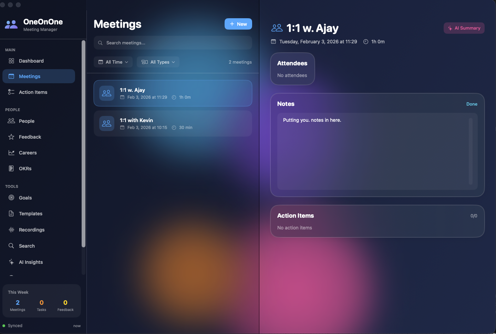
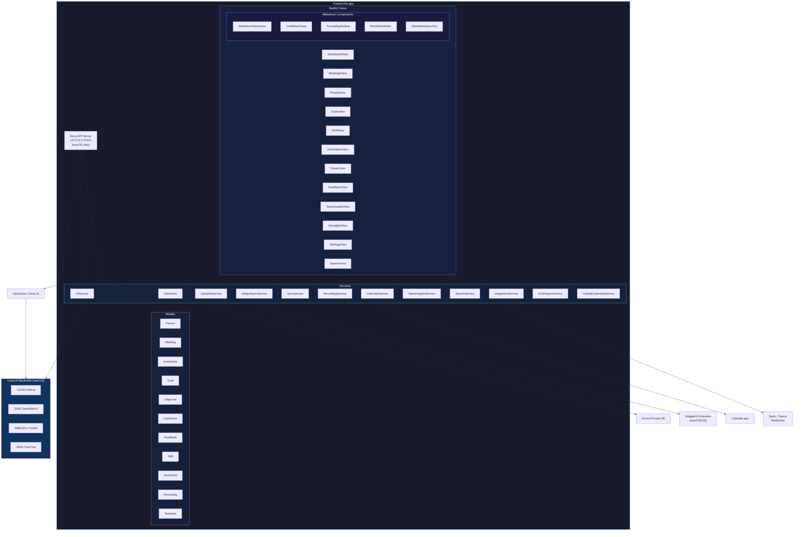

# OneOnOne

> **Note:** The Nova API functionality of this app (port 37421) has been retired. All meeting data access and AI summarization for Nova is now handled by [NovaControl](https://github.com/kochj23/NovaControl) on port 37400. This app no longer needs to be running for Nova to access meeting data or generate summaries.


A native macOS and iOS application for engineering managers who run 1:1s, team meetings, and performance reviews. OneOnOne combines meeting management, action item tracking, goal and OKR planning, career development, and AI-powered summaries into a single privacy-first tool. All AI inference runs locally on your Mac via Ollama, OpenWebUI, MLX, or TinyChat -- your data never leaves your machine.

Written by Jordan Koch.

---

## Screenshots



---

## Architecture


```mermaid
graph TB
    subgraph OneOnOne.app
        subgraph Views["SwiftUI Views"]
            DashboardView
            MeetingsView
            PeopleView
            GoalsView
            OKRView
            ActionItemsView
            CareerView
            FeedbackView
            TeamInsightsView
            AIInsightsView
            SettingsView
            SearchView
            subgraph Markdown["Markdown Components"]
                MarkdownNotesView
                CodeBlockView
                FormattingToolbar
                RichNotesEditor
                InlineMarkdownText
            end
        end

        subgraph Services
            DataStore
            AIService
            CloudKitService
            CalendarService
            SyncService
            RecordingService
            IntegrationService
            TeamInsightsService
            SearchService
            WidgetSyncService
            OLMImportService
            OutlookCalendarService
        end

        subgraph Models
            Person
            Meeting
            ActionItem
            Goal
            Objective
            KeyResult
            Feedback
            Skill
            Sentiment
            Recording
            Template
        end

        NovaAPIServer["Nova API Server<br/>127.0.0.1:37421<br/>(macOS only)"]
    end

    Views --> Services
    Services --> Models
    Services --> DataStore

    NovaAPIServer --> DataStore
    NovaAPIServer --> AIService
    CloudKitService --> iCloud["iCloud Private DB"]
    WidgetSyncService --> Widget["WidgetKit Extension<br/>(macOS/iOS)"]
    CalendarService --> Calendar["Calendar.app"]
    IntegrationService --> Slack["Slack / Teams<br/>Webhooks"]

    NovaAPIServer --> Nova["OpenClaw / Nova AI"]
    Nova --> Backends

    subgraph Backends["Local AI Backends (macOS)"]
        Ollama[":11434 Ollama"]
        OpenWebUI[":3000 OpenWebUI"]
        MLXToolkit[":8800 MLX Toolkit"]
        TinyChat[":8000 TinyChat"]
    end

    AIService --> Backends

    style OneOnOne.app fill:#1a1a2e,stroke:#3BDAFC,color:#fff
    style Views fill:#16213e,stroke:#9966FF,color:#fff
    style Services fill:#16213e,stroke:#4DE094,color:#fff
    style Models fill:#16213e,stroke:#FF9933,color:#fff
    style Backends fill:#0f3460,stroke:#FF5999,color:#fff
    style Markdown fill:#1a1a3e,stroke:#5AB3FF,color:#fff
```

---

## Features

### Meeting Management
- Track 1:1s, team meetings, stand-ups, retrospectives, planning sessions, reviews, brainstorms, interviews, and training
- Record agendas, free-form notes, and structured outcomes per meeting
- Log decisions with rationale and participant attribution
- Tag meetings and track mood (Productive, Challenging, Neutral, Positive, Tense)
- Recurring meeting support with calendar integration
- Outlook calendar import via OLM files and web import

### People Management
- Maintain profiles with name, title, department, email, and custom tags
- Set meeting frequency preferences (Daily through Quarterly, or As Needed)
- View complete meeting history per person with last-met and next-scheduled dates
- Color-coded avatar initials

### Action Items
- Central cross-meeting action item dashboard
- Priority levels: Low, Medium, High, Urgent
- Due date tracking with overdue and due-soon alerts
- Assignee management linked to person profiles
- Filter by priority, assignee, or completion status

### Goal Tracking
- Categories: Development, Performance, Learning, Project, Personal, Team, Career
- Milestone tracking with automatic progress calculation
- Link goals to related meetings for context
- Status: Not Started, In Progress, On Hold, Completed, Cancelled

### OKR System (Objectives and Key Results)
- Create objectives with measurable key results
- Metric types: Increase, Decrease, Maintain, Binary (Yes/No)
- Hierarchical/cascading OKRs at Company, Department, Team, and Individual levels
- Quarterly planning with status tracking (On Track, At Risk, Behind, Achieved, Cancelled)
- Key result update history with notes

### Career Development
- Skill tracking: Technical, Leadership, Communication, Problem Solving, Collaboration, Domain Knowledge, Project Management
- Proficiency levels: Beginner, Intermediate, Advanced, Expert
- Target skill level setting with gap analysis
- Assessment history

### Feedback System
- Types: Praise, Recognition, Constructive, Achievement, Thanks, Milestone
- Direction tracking (Given / Received)
- Link feedback to meetings for context
- Monthly aggregation and trend analysis

### Team Insights
- Relationship health scoring with trend analysis (Improving, Stable, Declining)
- Sentiment tracking on a 1--5 scale
- Risk factor identification
- Cross-person pattern recognition

### Search
- Full-text search across meetings, people, goals, and action items
- Search history

### Data Portability and Sync
- iCloud sync via CloudKit with incremental change tokens
- JSON export and import with merge (does not overwrite existing records)
- Automatic local backups
- All data persisted as JSON in Application Support/OneOnOne/

### AI-Powered Insights (macOS only)
- Meeting summary generation from notes
- Automatic action item extraction
- Conversation starter suggestions based on meeting history
- Weekly recaps across all meetings and open action items
- Follow-up topic suggestions
- Goal progress analysis with recommendations
- Email summarization for Nova integration
- Multi-backend support with automatic failover

### Calendar Integration (macOS and iOS)
- Sync with system Calendar.app
- Create calendar events for meetings
- Recurring meeting support
- Outlook calendar integration

### Voice Recording and Transcription (macOS only)
- Audio recording with consent tracking
- Whisper-based transcription via bundled Python script
- Speaker diarization support
- Recordings linked to meetings

### Third-Party Integrations (macOS only)
- Slack webhook integration for sharing meeting summaries
- Microsoft Teams webhook integration

### WidgetKit Extension (macOS and iOS)
- Small, Medium, and Large widget sizes
- Upcoming meetings at a glance
- Overdue action item count
- People due for a meeting
- Automatic refresh when app data changes
- App Group data sharing between app and widget

### Markdown & Code Snippets

OneOnOne supports Slack-style markdown formatting across all text areas. Notes are stored as plain strings (no migration required) and rendered with rich formatting in view mode.

**Code blocks** with optional language labels:

````
```sql
SELECT name, last_meeting
FROM people
WHERE meeting_overdue = true;
```
````

**Formatting toolbar** provides one-tap insertion of all syntax elements:

```
+------+--------+-------+---+----------+--------+
|  B   |   I    |  </>  | | |   { }    |   *    |
| Bold | Italic | Code  |   | Block    | Bullet |
+------+--------+-------+---+----------+--------+
```

**Supported syntax:**

| Syntax | Renders As |
|---|---|
| `**text**` | **Bold** |
| `*text*` | *Italic* |
| `` `code` `` | Inline code (cyan monospace with background) |
| ```` ``` ```` | Fenced code block with copy button |
| ```` ```swift ```` | Code block with language label |
| `- item` or `* item` | Bullet list with accent-colored bullets |

**Code block features:**
- Language label badge (top-left corner)
- Copy-to-clipboard button with animated checkmark feedback
- Horizontal scroll for long lines
- Monospace font on dark glass background
- Text selection enabled

**Applied across all text areas:**

| View | Edit Mode | View Mode |
|---|:---:|:---:|
| Meeting Notes | Toolbar + Editor | Markdown Renderer |
| Person Notes | Toolbar + Editor | Markdown Renderer |
| Feedback | Toolbar + Editor | Markdown Renderer |
| Meeting Agenda | Toolbar + Editor | -- |
| Goal Description | Toolbar + Editor | -- |
| Career Goals | Toolbar + Editor | -- |

**Rendering pipeline:**

```
                     Plain String (stored in JSON)
                              |
                              v
                   +--------------------+
                   |  MarkdownParser    |
                   |  (block-level)     |
                   +----+-------+-------+
                        |       |       |
                   text |  code |  list |
                        v       v       v
             +----------+ +----------+ +-----------+
             | Inline   | | CodeBlock| | Bullet    |
             | Markdown | | View     | | List      |
             | Text     | |          | | View      |
             +----------+ +----------+ +-----------+
                  |            |             |
                  |   +--------+--------+    |
                  |   | Language label  |    |
                  |   | Copy button    |    |
                  |   | Monospace text  |    |
                  |   +----------------+    |
                  v                         v
        AttributedString          Accent-colored
        (markdown: ...)           bullet points
           |
           +-- **bold** --> .bold weight
           +-- *italic* --> .italic trait
           +-- `code` --> cyan monospace + background
```

### Design
- Glassmorphic dark-mode UI with navy gradient backgrounds
- Animated floating blobs
- Frosted glass panels
- Vibrant accent palette: cyan, purple, pink, orange, green
- Consistent with the MLXCode design system

---

## Platform Feature Matrix

| Feature | macOS | iOS |
|---|:---:|:---:|
| Meeting Management | Yes | Yes |
| People Management | Yes | Yes |
| Action Items | Yes | Yes |
| Goals and OKRs | Yes | Yes |
| Career Development | Yes | Yes |
| Feedback System | Yes | Yes |
| Markdown & Code Snippets | Yes | Yes |
| Team Insights | Yes | Yes |
| iCloud Sync | Yes | Yes |
| Calendar Integration | Yes | Yes |
| WidgetKit Widgets | Yes | Yes |
| AI Insights | Yes | -- |
| Voice Recording | Yes | -- |
| Transcription | Yes | -- |
| Slack/Teams Integration | Yes | -- |
| Nova API Server | Yes | -- |

---

## Nova API Server

OneOnOne exposes a local HTTP API on `127.0.0.1:37421` for integration with Nova (OpenClaw AI assistant) and other local tools. The server starts automatically when the macOS app launches and binds to the loopback interface only -- there is no external network exposure.

### Endpoints

#### GET /api/status

Returns app status, name, version, and port.

```bash
curl -s http://127.0.0.1:37421/api/status
```

```json
{
  "status": "running",
  "app": "OneOnOne",
  "version": "1.0",
  "port": "37421"
}
```

#### GET /api/meetings?limit=N

Returns the N most recent meetings sorted by date descending. Default limit is 20.

```bash
curl -s http://127.0.0.1:37421/api/meetings?limit=5
```

#### GET /api/meetings/{uuid}

Returns a single meeting by UUID, including notes, action items, decisions, and follow-ups.

```bash
curl -s http://127.0.0.1:37421/api/meetings/550e8400-e29b-41d4-a716-446655440000
```

Returns 400 for invalid UUIDs, 404 if not found.

#### GET /api/people

Returns all people profiles.

```bash
curl -s http://127.0.0.1:37421/api/people
```

#### POST /api/summarize

Submits text content (such as an email) and returns an AI-generated summary. Requires a JSON body with a `content` field. An optional `context` field provides additional context for the summary.

```bash
curl -s -X POST http://127.0.0.1:37421/api/summarize \
  -H "Content-Type: application/json" \
  -d '{"content": "Full email body here", "context": "Q1 planning thread"}'
```

```json
{
  "summary": "AI-generated summary text..."
}
```

Returns 400 if `content` is missing or empty, 500 if the AI backend is unavailable.

#### POST /api/meetings/{uuid}/summary

Generates an AI summary for a specific meeting's notes and saves it to the meeting record.

```bash
curl -s -X POST http://127.0.0.1:37421/api/meetings/550e8400-e29b-41d4-a716-446655440000/summary
```

```json
{
  "summary": "Generated summary text...",
  "meetingId": "550e8400-e29b-41d4-a716-446655440000"
}
```

Returns 404 if meeting not found, 422 if meeting has no notes, 500 if AI generation fails.

### Error Responses

All errors return JSON with an `error` field:

```json
{
  "error": "Description of what went wrong"
}
```

### Authentication

The API runs on loopback only (`127.0.0.1`) and requires no authentication for local macOS requests. iOS requests require an `X-Nova-Token` header.

---

## AI Backends

OneOnOne supports four local AI backends. The app probes each on startup and automatically selects the first available provider. You can switch providers in Settings.

| Backend | Default Endpoint | Protocol |
|---|---|---|
| Ollama | http://localhost:11434 | Ollama native API |
| OpenWebUI | http://localhost:3000 | OpenAI-compatible |
| MLX Toolkit | http://localhost:8800 | OpenAI-compatible |
| TinyChat | http://localhost:8000 | OpenAI-compatible |

All endpoints, models, and the selected provider are configurable in the app's Settings view and persisted in UserDefaults.

**Bundled Python scripts** (macOS only, in the `Python/` directory):
- `ai_daemon.py` -- MLX-based local inference daemon
- `whisper_transcribe.py` -- Whisper-based audio transcription

---

## Installation

### macOS (recommended)

Download the DMG from the [latest release](https://github.com/kochj23/OneOnOne/releases/latest) and drag OneOnOne.app to your Applications folder.

OneOnOne is distributed directly via DMG. It is not available on the Mac App Store. The app runs without sandbox restrictions so it can access local AI backends, voice recording hardware, and the full file system.

### iOS

Install via TestFlight or build from source.

### Setting Up AI Features (macOS)

1. Install a local AI backend. Ollama is the simplest:

```bash
brew install ollama
ollama pull llama3.2
ollama serve
```

2. Launch OneOnOne. It will detect Ollama automatically.

Alternatively, if you already run OpenWebUI, MLX Toolkit (mlx_lm.server), or TinyChat, OneOnOne will detect and use those.

For the bundled MLX daemon and Whisper transcription:

```bash
pip3 install mlx mlx-lm
pip3 install huggingface-hub openai-whisper
huggingface-cli download mlx-community/Llama-3.2-3B-Instruct-4bit \
  --local-dir ~/.mlx/models/Llama-3.2-3B-Instruct-4bit
```

### iCloud Sync Setup

1. Sign in to iCloud on all devices.
2. Enable iCloud for OneOnOne in System Settings (macOS) or Settings (iOS).
3. Data syncs automatically in the background using CloudKit with incremental change tokens.

Synced data: People, Meetings, Action Items, Goals, OKRs, Feedback, Career Profiles, Sentiment History, Recordings metadata.

---

## Building from Source

### Requirements

- macOS 14.0+ with Xcode 15+
- Apple Silicon (M1/M2/M3/M4) for AI features
- XcodeGen for project generation

### Build

```bash
brew install xcodegen
cd /path/to/OneOnOne
xcodegen generate

# macOS
xcodebuild -scheme OneOnOne -configuration Release

# iOS
xcodebuild -scheme OneOnOne-iOS -configuration Release \
  -destination 'generic/platform=iOS'
```

### Targets

| Target | Platform | Bundle ID |
|---|---|---|
| OneOnOne | macOS 14.0+ | com.jordankoch.OneOnOne |
| OneOnOne-iOS | iOS 17.0+ | com.jordankoch.OneOnOne |
| OneOnOneWidget-macOS | macOS 14.0+ | com.jordankoch.OneOnOne.Widget |
| OneOnOneWidget-iOS | iOS 17.0+ | com.jordankoch.OneOnOne.Widget |

---

## Technical Details

### Data Storage

All data is stored as JSON files in `~/Library/Application Support/OneOnOne/`:

| File | Contents |
|---|---|
| people.json | Person profiles |
| meetings.json | Meetings with embedded action items, decisions, follow-ups |
| goals.json | Goals with milestones |
| objectives.json | OKRs with key results and update history |
| feedback.json | Feedback entries |
| career_profiles.json | Skill inventories keyed by person UUID |
| sentiment.json | Sentiment history keyed by person UUID |
| templates.json | Meeting templates (built-in and custom) |
| recordings.json | Recording metadata |
| integrations.json | Slack and Teams webhook configuration |

Voice recordings are stored in `~/Library/Application Support/OneOnOne/Recordings/`.

### Sync Architecture

- **iCloud**: CloudKit private database with a custom record zone. Incremental sync via server change tokens. Debounced push on local saves. Remote notification subscription (`OneOnOne-Changes`) triggers pull on other devices.
- **Widget**: App Group shared container with `WidgetSyncService` pushing data to the widget extension. Widget refreshes automatically on data changes.

### Key Frameworks

- SwiftUI (UI layer, all platforms)
- Foundation `AttributedString(markdown:)` (inline markdown rendering)
- CloudKit (iCloud sync)
- Network.framework (Nova API server via NWListener)
- AVFoundation (voice recording, macOS)
- EventKit (calendar integration)
- WidgetKit (home screen widgets)

### Keyboard Shortcuts (macOS)

| Shortcut | Action |
|---|---|
| Cmd+N | New Meeting |
| Cmd+Shift+N | New Person |
| Cmd+Shift+G | New Goal |
| Cmd+Shift+E | Export Data |
| Cmd+Shift+I | Import Data |
| Cmd+Option+S | Sync with iCloud |

---

## Test Suite

OneOnOne includes a comprehensive XCTest suite with 195 tests covering unit, functional, security, and integration layers.

### Running Tests

```bash
cd /path/to/OneOnOne
xcodegen generate
xcodebuild test -scheme OneOnOne -destination 'platform=macOS' -only-testing:OneOnOneTests
```

### Test Coverage

| Test File | Category | Tests | What It Covers |
|---|---|---:|---|
| MeetingModelTests | Unit | 19 | Meeting init, duration formatting, action item counts, Equatable/Hashable, Codable, MeetingType, MeetingMood |
| PersonModelTests | Unit | 17 | Person init, initials generation, displayTitle, avatar colors, MeetingFrequency calendar days, Codable |
| ActionItemModelTests | Unit | 22 | ActionItem CRUD, markComplete/markIncomplete, overdue/dueSoon logic, Priority sort order, Decision, FollowUp |
| GoalModelTests | Unit | 20 | Goal init, progress calculation from milestones, overdue detection, Milestone markComplete, GoalCategory, GoalStatus |
| OKRModelTests | Unit | 19 | Objective progress, KeyResult metric types (increase/decrease/maintain/binary), formatting, cascading hierarchy |
| FeedbackModelTests | Unit | 8 | Feedback init, FeedbackType/Direction, PraiseSummary ratio calculation |
| SentimentModelTests | Unit | 19 | SentimentEntry overall score, stress penalty, floor-at-zero, RelationshipHealth levels, HealthTrend |
| TemplateModelTests | Unit | 11 | Template agenda generation, built-in templates validation (count, names, durations), AgendaItem |
| CareerDevelopmentModelTests | Unit | 14 | Skill gap analysis, CareerProfile training counts, SkillLevel, PromotionReadiness, TrainingType |
| RecordingModelTests | Unit | 10 | Recording duration/size formatting, Transcription word count, TranscriptSegment time ranges |
| ExportImportTests | Functional | 9 | ExportData round-trip Codable, empty collections, full-field export, JSON corruption handling, cross-model relationships |
| SecurityTests | Security | 16 | Hardcoded credential scan (AWS/OpenAI/GitHub/Slack patterns), input sanitization (Unicode, XSS, SQL injection payloads), sensitive file detection, UUID validation, entitlements verification |
| IntegrationTests | Integration | 11 | Nova API health check (port 37421), endpoint validation (status/people/meetings/404/401), SearchFilters, data flow, OKR cascading |

### Test Categories

**Unit Tests** (159 tests): Pure model and enum testing with no external dependencies. Fast, deterministic, run in under 1 second.

**Functional Tests** (9 tests): Data serialization round-trips, relationship integrity, error handling for corrupt input.

**Security Tests** (16 tests): Static analysis of source files for credential patterns, input fuzzing with malicious payloads, sensitive file detection, entitlement verification.

**Integration Tests** (11 tests): Live health checks against the Nova API server on port 37421. These tests use `XCTSkip` when the app is not running, so they do not block CI but validate the full stack locally.

---

## Privacy

- All meeting data is stored locally on your device.
- iCloud sync uses end-to-end encrypted CloudKit private database.
- AI features run entirely on your machine -- no data is sent to external servers.
- Calendar access is used only to create and sync meeting events.
- Voice recordings are stored locally and never uploaded.
- The Nova API server binds to 127.0.0.1 only.

---

## Version History

### v2.8.0
- Slack-style markdown rendering in all text areas (meeting notes, person notes, feedback, agendas, goals, career goals)
- Fenced code blocks with language labels and copy-to-clipboard button
- Inline code, bold, italic, and bullet list rendering
- Formatting toolbar with one-tap syntax insertion (Bold, Italic, Code, Code Block, Bullet List)
- New reusable components: MarkdownNotesView, CodeBlockView, FormattingToolbar, RichNotesEditor, InlineMarkdownText
- Person notes now have edit/view toggle (was always-edit before)
- Fix: CloudKitService deferred initialization to prevent crash on macOS 26

### v2.7.0
- Nova API server on port 37421 for OpenClaw integration
- POST /api/summarize endpoint for email summarization
- POST /api/meetings/{uuid}/summary for AI meeting summary generation

### v2.2.0
- Multi-backend AI support (Ollama, OpenWebUI, MLX Toolkit, TinyChat)
- Automatic backend detection and failover
- Outlook calendar integration (OLM import, web import)

### v2.1.0
- WidgetKit extension (Small, Medium, Large sizes)
- App Group data sharing for widget
- Automatic widget refresh

### v2.0.0
- iOS support
- iCloud sync via CloudKit
- Cross-platform synchronization

### v1.1.0
- AI-powered insights (meeting summaries, action item extraction, weekly recaps)
- Calendar integration
- Voice recording and Whisper transcription

### v1.0.0
- Initial macOS release
- Meeting, people, goal, and action item management
- Feedback and career development tracking
- OKR system
- Team insights and sentiment tracking

---

## License

MIT License

Copyright (c) 2026 Jordan Koch

Permission is hereby granted, free of charge, to any person obtaining a copy
of this software and associated documentation files (the "Software"), to deal
in the Software without restriction, including without limitation the rights
to use, copy, modify, merge, publish, distribute, sublicense, and/or sell
copies of the Software, and to permit persons to whom the Software is
furnished to do so, subject to the following conditions:

The above copyright notice and this permission notice shall be included in all
copies or substantial portions of the Software.

THE SOFTWARE IS PROVIDED "AS IS", WITHOUT WARRANTY OF ANY KIND, EXPRESS OR
IMPLIED, INCLUDING BUT NOT LIMITED TO THE WARRANTIES OF MERCHANTABILITY,
FITNESS FOR A PARTICULAR PURPOSE AND NONINFRINGEMENT. IN NO EVENT SHALL THE
AUTHORS OR COPYRIGHT HOLDERS BE LIABLE FOR ANY CLAIM, DAMAGES OR OTHER
LIABILITY, WHETHER IN AN ACTION OF CONTRACT, TORT OR OTHERWISE, ARISING FROM,
OUT OF OR IN CONNECTION WITH THE SOFTWARE OR THE USE OR OTHER DEALINGS IN THE
SOFTWARE.

---

## Author

Written by Jordan Koch ([kochj23](https://github.com/kochj23)).

---

## More Apps by Jordan Koch

| App | Description |
|---|---|
| [MLXCode](https://github.com/kochj23/MLXCode) | Local AI coding assistant for Apple Silicon |
| [NMAPScanner](https://github.com/kochj23/NMAPScanner) | Network scanning and host discovery tool |
| [RsyncGUI](https://github.com/kochj23/RsyncGUI) | macOS GUI for rsync backup and sync |
| [JiraSummary](https://github.com/kochj23/JiraSummary) | AI-powered Jira dashboard with sprint analytics |
| [MailSummary](https://github.com/kochj23/MailSummary) | AI-powered email categorization and summarization |
| [ExcelExplorer](https://github.com/kochj23/ExcelExplorer) | Native macOS Excel/CSV file viewer |
| [TopGUI](https://github.com/kochj23/TopGUI) | macOS system monitor with real-time metrics |

[View all projects](https://github.com/kochj23?tab=repositories)

---

> Disclaimer: This is a personal project created on my own time. It is not affiliated with, endorsed by, or representative of my employer.
